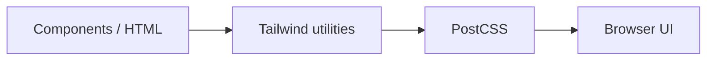

# 🌐 Vibhu_Ngo

<p align="center"></p>

<p align="center"><b>A Vite + Tailwind CSS frontend project.</b></p>

<p align="center">  </p>

## 🧱 Stack
- Vite for development and production builds
- Tailwind CSS for utility-first styling
- PostCSS for CSS processing
- JavaScript frontend source under `src/`

## 🚀 Setup
```bash
git clone https://github.com/Abhishek7258/Vibhu_Ngo.git
cd Vibhu_Ngo
npm install
npm run dev
```

Check `package.json` for available scripts.

## 📁 Structure
```text
Vibhu_Ngo/
├── src/
├── index.html
├── tailwind.config.js
├── postcss.config.js
├── vite.config.js
└── package.json
```

## 🎨 Styling Flow


## 📸 Recommended README Assets
Add desktop, tablet and mobile screenshots under `docs/screenshots/` and link them from this section.

## 🤝 Contributing
Keep styling responsive and reusable. Run the project's lint/build checks before submitting changes.

## 📄 License
No license file is currently declared.